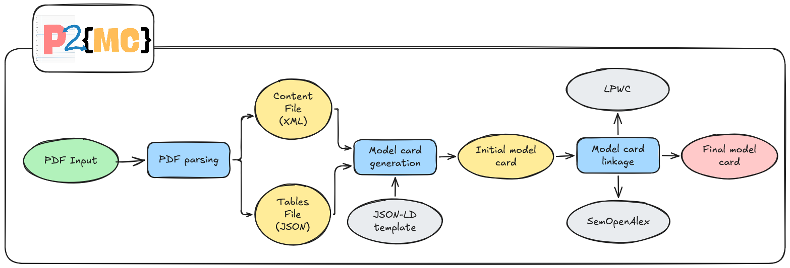

# P2MC

<p align="center">
  
</p>

P2MC extracts metadata, tables, narratives, links, and implementation details from scientific papers, mainly Knowledge Graph Embedding papers, and generates JSON-LD ModelCards.

## References

- [Model Cards for Model Reporting](https://arxiv.org/abs/1810.03993)
- [SciPDF Parser](https://github.com/titipata/scipdf_parser)
- [LightOnOCR-2-1B](https://huggingface.co/lightonai/LightOnOCR-2-1B)

## Architecture



The recommended runtime flow is:

1. The Streamlit frontend submits an arXiv URL to the FastAPI backend.
2. FastAPI creates a file-backed job under `backend/data/jobs/` and publishes it to RabbitMQ.
3. The worker consumes the job, downloads the PDF, runs GROBID/SciPDF and LightOCR, then builds the ModelCard.
4. Generated artifacts are written under `backend/data/` and exposed through the backend API.

Main services:

- `p2mc-frontend`: Streamlit UI for launching jobs and browsing generated outputs.
- `p2mc-backend`: FastAPI API for job launch, job status, job listing, and artifact downloads.
- `p2mc-worker`: RabbitMQ consumer that runs the PDF processing pipeline.
- `rabbitmq`: queue between API and worker.
- `grobid`: XML extraction service used by the SciPDF parser.
- `ollama` and `ollama-init`: local LLM runtime and model bootstrap.

## Requirements

Docker and Docker Compose are the primary way to run the project. Python 3.11 and Poetry are only needed for local development or direct pipeline execution.

Copy `.env.example` to `.env` and configure the model names and `HF_TOKEN` before running the real worker.

## Quick Start

```powershell
Copy-Item .env.example .env
docker build -t p2mc-backend ./backend
docker compose up -d --build
```

Open:

- Frontend: <http://localhost:5678>
- Backend docs: <http://localhost:8000/docs>

Useful commands:

```powershell
docker compose logs -f p2mc-worker
docker compose logs -f p2mc-backend
docker compose logs -f p2mc-frontend
docker compose down
```

## Usage

From the frontend:

1. Open `http://localhost:5678`.
2. Use the `Generate` page to submit an arXiv URL.
3. Use the `Jobs` page to refresh status and download artifacts.

From the API:

- `POST /job/launch-job`
- `GET /job/jobs`
- `GET /job/job-status/{job_id}`
- `GET /job/{job_id}/artifacts/{artifact_name}`

Direct local pipeline execution is also available for development:

```powershell
cd backend
poetry install
poetry run python run_full_iteration.py
```

`run_full_iteration.py` runs the pipeline for a fixed paper URL and writes outputs under `backend/data/`.

## Project Structure

```text
.
|-- backend/
|   |-- app/
|   |   |-- main.py                 # FastAPI app and CORS setup
|   |   |-- routers/jobs.py          # Job launch, listing, status, and artifact routes
|   |   `-- schemas/jobs.py          # API request/response schemas
|   |-- data/                        # Runtime data mounted into containers
|   |   |-- jobs/                    # Job status files
|   |   |-- raw/pdfs/                # Downloaded PDFs
|   |   |-- interim/scipdf_xml/      # GROBID/SciPDF XML outputs
|   |   |-- interim/lightocr_json/   # LightOCR table outputs
|   |   `-- processed/modelcards/    # Generated JSON-LD ModelCards
|   |-- extractors/                  # LLM, dataset, metric, task, and category extractors
|   |-- parsers/                     # SciPDF/GROBID and LightOCR parser wrappers
|   |-- rabbitmq/                    # RabbitMQ connection and publishing helpers
|   |-- resources/                   # Taxonomy classifier, task resources, figures
|   |-- templates/                   # JSON-LD templates used by the generator
|   |-- testing_data/                # Committed sample XML/OCR/reference data
|   |-- utils/                       # URI, XML, matching, mapping, and evaluation helpers
|   |-- Dockerfile
|   |-- model_card_generation_pipeline.py
|   |-- pdf_handler.py               # Pipeline orchestrator
|   |-- run_full_iteration.py        # Direct local execution script
|   `-- worker.py                    # RabbitMQ worker entrypoint
|-- frontend/
|   |-- app.py                       # Streamlit navigation entrypoint
|   |-- assets/                      # Demo images and example JSON/XML assets
|   |-- components/job_status.py     # Shared job status/artifact UI
|   |-- pages/main_page.py           # Generate page
|   |-- pages/jobs_page.py           # Jobs browser page
|   |-- services/p2mc_api.py         # Frontend HTTP client for the FastAPI API
|   `-- Dockerfile
|-- rabbitmq/rabbitmq.conf           # RabbitMQ runtime configuration
|-- docker-compose.yml               # Local service topology
|-- .env.example                     # Environment variable template
|-- CHANGELOG.md                     # Short change history
`-- README.md
```

## Operational Notes

- Compose mounts `./backend/data` into backend and worker containers, so generated artifacts persist on the host.
- The worker can run in dummy mode for smoke tests with `P2MC_USE_DUMMY_WORKER=true`; the real pipeline requires GROBID, Ollama models, and Hugging Face access.
- LightOCR memory use is controlled by `P2MC_LIGHTOCR_TARGET_LONGEST` and `P2MC_LIGHTOCR_MAX_NEW_TOKENS` in `.env.example`.
- If a job fails after generating intermediate files, rerunning can reuse existing PDF/XML/OCR artifacts.
- Use `CHANGELOG.md` for recent project changes.
